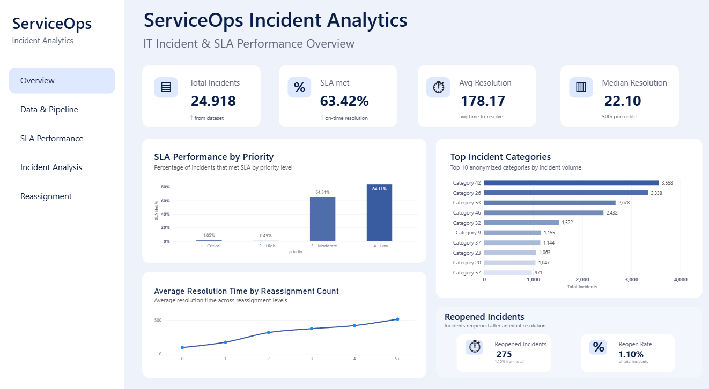

# ServiceOps Data Pipeline

End-to-end data engineering and analytics project for IT incident data.

The project turns raw incident logs into cleaned PostgreSQL tables and a Power BI dashboard for SLA, resolution time, reopens, and reassignments.



## What This Project Does

The raw dataset has **141,712 event records** from **24,918 unique incidents**.

One incident can appear in multiple rows because each row represents an update during the incident lifecycle.

This project:

- profiles the raw data
- cleans missing values and datetime fields
- loads event-level data into PostgreSQL
- transforms the data into one row per incident
- analyzes SLA and incident performance
- visualizes the results in Power BI

## Pipeline

Raw CSV  
→ Profiling  
→ Cleaning  
→ PostgreSQL Staging  
→ Analytics Table  
→ Power BI

### Main Tables

`staging.incident_events`

- 141,712 cleaned event records
- keeps the incident history

`analytics.fact_incidents`

- 24,918 rows
- one row per incident
- contains final incident state and lifecycle metrics

## Dataset

- Raw events: **141,712**
- Unique incidents: **24,918**
- Source columns: **36**
- Analytics grain: **1 row per incident**

The dataset is anonymized, so category and organization names are shown as IDs such as `Category 42`.

## Data Cleaning

The cleaning pipeline:

- changes `"?"` into null values
- treats `-100` incident states as missing
- converts date columns into datetime
- creates numeric levels for priority, urgency, and impact
- keeps the original raw data unchanged
- checks for duplicate event records

## Analysis

The final analytics table includes:

- SLA status
- incident priority
- resolution time
- closure time
- reopen count
- reassignment count
- assignment group count
- final incident state

## Key Findings

- **24,918** incidents were analyzed
- **63.42%** of incidents met SLA
- average resolution time was **178.17 hours**
- median resolution time was **22.10 hours**
- **275 incidents (1.10%)** were reopened
- incidents with more reassignments generally had longer average resolution times
- `Category 42` had the highest incident volume

The large gap between average and median resolution time suggests that some long-running incidents pull the average upward.

## Dashboard

The Power BI report has five pages:

- Overview
- Data & Pipeline
- SLA Performance
- Incident Analysis
- Reassignment Analysis

More screenshots are available in `dashboard/screenshots/`.

## Tech Stack

- Python
- Pandas
- PostgreSQL
- SQL
- SQLAlchemy
- Power BI
- DAX
- Git

## Project Structure

```text
serviceops-data-pipeline/
├── dashboard/
│   ├── ServiceOps_Incident_Analytics.pbix
│   └── screenshots/
├── data/
│   ├── raw/
│   └── processed/
├── notebooks/
│   └── profile_data.ipynb
├── src/
│   ├── clean_data.py
│   └── load_postgres.py
├── sql/
│   ├── schema.sql
│   ├── analytics.sql
│   └── business_queries.sql
├── .gitignore
├── README.md
└── requirements.txt
```

## How to Run

### 1. Clone the repository

```bash
git clone https://github.com/kalilank/serviceops-data-pipeline.git
cd serviceops-data-pipeline
```

### 2. Create a virtual environment

```bash
python -m venv .venv
```

Activate it on Windows:

```bash
.venv\Scripts\activate
```

### 3. Install the dependencies

```bash
pip install -r requirements.txt
```

### 4. Add the dataset

Download the incident dataset and place it here:

```text
data/raw/incident_event_log.csv
```

### 5. Run the cleaning pipeline

```bash
python src/clean_data.py
```

This creates:

```text
data/processed/incidents_clean.csv
```

### 6. Set up PostgreSQL

Create a PostgreSQL database named:

```text
serviceops
```

Then create a `.env` file in the project root:

```env
DB_HOST=localhost
DB_PORT=5432
DB_NAME=serviceops
DB_USER=postgres
DB_PASSWORD=your_password
```

### 7. Create the database schema

Run:

```text
sql/schema.sql
```

in PostgreSQL.

This creates the `staging` and `analytics` schemas.

### 8. Load the cleaned data

```bash
python src/load_postgres.py
```

The script loads the cleaned event data into:

```text
staging.incident_events
```

and checks that the PostgreSQL row count matches the CSV row count.

### 9. Build the analytics table

Run:

```text
sql/analytics.sql
```

This creates:

```text
analytics.fact_incidents
```

with one row per incident.

### 10. Run the analysis queries

Run:

```text
sql/business_queries.sql
```

to view the main SLA, category, reopen, and reassignment metrics.

### 11. Open the Power BI dashboard

Open:

```text
dashboard/ServiceOps_Incident_Analytics.pbix
```

The report uses `analytics.fact_incidents` as its main data source.

## Limitations

- The dataset uses anonymized category and organization labels.
- Resolution time uses total elapsed time, not working hours.
- Reassignment and resolution time show an association, not proof of causation. 